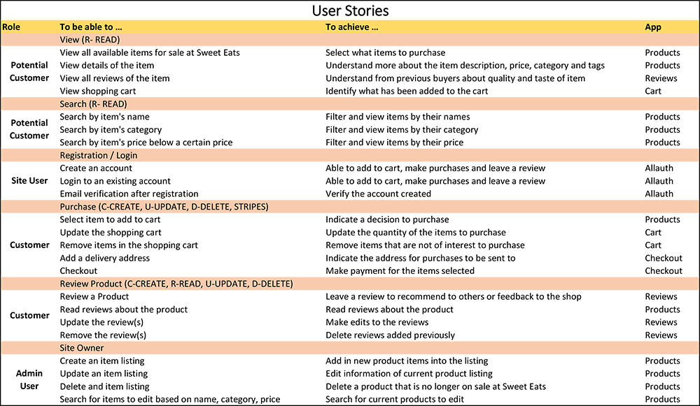

# Sweet Eats Bakery Online Shop
# Code Institute - Full Stack Frameworks with Django Milestone Project (4)

This is an online shop for Sweet Eats Bakery. 

To meet the increasing demand of consumers turning to online platforms for food products like cakes, chocolates and macarons, Sweet Eats requires a platform to increase revenue by selling high their products online. Moreover, it gives a platform for consumers to leave their reviews and recommend other users visiting the site.

Hence, an online mobile-friendly website was created to enable potential consumers to register for an account, login, browse through the shop items, view details of the item, add or remove products from their shopping cart, checkout, make payments for their purchase and even leave reviews for the items.

For the site owner, there will be an admin panel where they are able to search for the existing items, create new item listing, edit existing listing and remove items that are not for sale at the shop.

The website may be accessed from [here](https://dlcw-sweeeat.herokuapp.com/)

##### To login as a site user
`username: chocolate`

`password: cakeslover`

##### To login as a site admin

`username: adminuser`

`password: adminaccess123`

## UX

In order to achieve the intent of capturing the viewers attention to the products that are showcased, the website aims to portray a very simple and minimalist feel. The use of blank space and clean minimalist icons allow the viewer attention to be focused mainly on the products. A five-colour palette scheme consisting of mostly warm colours was maintained throughout the whole website design. This is consistent and evident through the the wireframe. A copy of the wireframe me be viewed [here](https://drive.google.com/file/d/1mpBa-qnHYB-iGsU0rAgWGLpVspTyOQpB/view?usp=sharing).

Besides the look, the website also ensure that it is user-friendly and interactive. When a user first enter the website, they will be greeted by four  photos (shows description upon hovering) which illustrate the categories of the items followed by a main navigation button which clearly specifies the intent - to bring them to view the products.

The use of minimal clicks to navigate the website allow users to have a good browsing experience when going through the website. Icons were placed with thought to allow users to intuitively click on them to navigate pages. 

At the products page, users are able to easily search the items by the name, category and/or the price. When the viewers click view more, they will be brought to show description, price and add to cart feature of the product.
A review section was added to allow some degree of interaction among the customers. They may add, edit or event delete review entries uploaded. 

When a user perform an action, a notification will pop-up which informs the user that the action is completed successfully or is an unsuccessful attempted.

When a site user or an admin user logins to the site, the top nav-bar shows different navlinks for different users. For instance, for a site user, it will just show welcome (username) in the middle section and a logout button at the far right. For a site admin, it will show welcome (admin name) in the middle section and a logout and admin button at the far right. The admin button brings the admin user to the admin site to view, add, update and delete products.

A user will be highly encouraged to register an account to view more features such as making a purchase and leaving a review. Hence, there will be a message to direct them to the register or login page.

Apart from that, the display of the website differs for a desktop and mobile view to allow the same experience on all devices and platforms. All in all, the website is created with the intent to fulfil the users' needs in a straighforward and forthcoming approach.

## User Stories


## Features

In this section, you should go over the different parts of your project, and describe each in a sentence or so.
 
### Existing Features
- Feature 1 - allows users X to achieve Y, by having them fill out Z
- ...

For some/all of your features, you may choose to reference the specific project files that implement them, although this is entirely optional.

In addition, you may also use this section to discuss plans for additional features to be implemented in the future:

### Features Left to Implement
- Another feature idea

## Technologies Used

### Frameworks
1. Django 2 (2.2.6)
2. Python 3

### Styling
* [HTML](https://www.w3schools.com/html/) - standard markup language for creating web pages
    - HTML is basically used throughout the whole document to construct the various segments and putting things together

* [CSS](https://www.w3schools.com/css/) - describes the style of the HTML document
    - CSS is important to maintain the look, style and feel of the website

* [Bootstrap 4.4](https://getbootstrap.com/docs/4.4/getting-started/introduction/) - popular framework for building responsive, mobile-first sites
    - Bootstrap framework makes things easier to have basic features and minimised the use of css styling with bootstrap features

* [Crispy Form](https://django-crispy-forms.readthedocs.io/en/latest/)
    - Display Django forms nicely on the webpages

* [Javascript](https://www.youtube.com/watch?v=gnDOjWUSHks)
    - Javascript is used to enhance the Cloudinary upload photo experience

* [Google Fonts](https://fonts.google.com/)
    - Used of appropriate fonts for website theme

* [Font Awesome](https://fontawesome.com/)
    - Add icons to enhance the feel for clickable links

### Additional Plugins
* Stripe (payments)
* Cloudinary (uploading of photos)
* Gunicorn (WSGI application server)
* Psycopg2 (PostgreSQL database adaptor for Python)
* Pillow (PIL fork)
* Whitenoise (simplified static file serving for Python web apps)

### Database
* PostgreSQL
* dbsqlite3

## Testing

In this section, you need to convince the assessor that you have conducted enough testing to legitimately believe that the site works well. Essentially, in this part you will want to go over all of your user stories from the UX section and ensure that they all work as intended, with the project providing an easy and straightforward way for the users to achieve their goals.

Whenever it is feasible, prefer to automate your tests, and if you've done so, provide a brief explanation of your approach, link to the test file(s) and explain how to run them.

For any scenarios that have not been automated, test the user stories manually and provide as much detail as is relevant. A particularly useful form for describing your testing process is via scenarios, such as:

1. Contact form:
    1. Go to the "Contact Us" page
    2. Try to submit the empty form and verify that an error message about the required fields appears
    3. Try to submit the form with an invalid email address and verify that a relevant error message appears
    4. Try to submit the form with all inputs valid and verify that a success message appears.

In addition, you should mention in this section how your project looks and works on different browsers and screen sizes.

You should also mention in this section any interesting bugs or problems you discovered during your testing, even if you haven't addressed them yet.

If this section grows too long, you may want to split it off into a separate file and link to it from here.

## Deployment
```
This section should describe the process you went through to deploy the project to a hosting platform (e.g. GitHub Pages or Heroku).

In particular, you should provide all details of the differences between the deployed version and the development version, if any, including:
- Different values for environment variables (Heroku Config Vars)?
- Different configuration files?
- Separate git branch?

In addition, if it is not obvious, you should also describe how to run your code locally.
```

## Credits

### Content
- The text for the Category Description is taken and modified from the following website
    - Cupcakes Description - [Twelve Cupcakes](https://twelvecupcakes.com/menu/cupcakes/)
    - Chocolate Truffles - [Awfully Chocolate](https://www.awfullychocolate.com/the-perfect-gift/gorgeous-truffles/)
    - Macarons - [TWG](https://twgtea.com/tea-table/gourmet-delicacies/twg-tea-macarons-assorted)
    - Whole Cakes - [Awfully Chocolate](https://www.awfullychocolate.com/chocolate-cakes/signature-cakes/)

- The quote and text for the "Our Story" is taken and modified from the following website
    - [Edith Patisserie](https://www.edithpatisserie.com/about-us)
    - [Pinterest] (https://www.pinterest.com/pin/538602436666824480/?nic_v2=1av5yJr3C)


### Media
- The photos used in this site were all obtained from [Unsplash](https://unsplash.com/) - a stock image library.
    Please refer to the Links of images used
    - https://unsplash.com/photos/li0iC0rjvvg
    - https://unsplash.com/photos/2XK4UufbjdU
    - https://unsplash.com/photos/_TN1m5R1pFI
    - https://unsplash.com/photos/dcPNZeSY3yk
    - https://unsplash.com/photos/GTMGG-xvxdU
    - https://unsplash.com/photos/On2VseHUDXw
    - https://unsplash.com/photos/tA3sJ4u09eU
    - https://unsplash.com/photos/9sKcBBMII6Q
    - https://unsplash.com/photos/a0ex7idMUG4
    - https://unsplash.com/photos/hB6HN7hzcgg
    - https://unsplash.com/photos/j_bB5QqigfU
    - https://unsplash.com/photos/116JtRtf0QI
    - https://unsplash.com/photos/xatIo9Ksfb0
    - https://unsplash.com/photos/Uv5FRPKBwvU
    - https://unsplash.com/photos/KPpU6rCIziQ
    - https://unsplash.com/photos/UxnSB5nTZDs
    - https://unsplash.com/photos/mLfDsNR-bs0
    - https://unsplash.com/photos/8Vuq1nSzmgo
    - https://unsplash.com/photos/yHpA0SYKfMY
    - https://unsplash.com/photos/rXB9YjOQX8I
    - https://unsplash.com/photos/lo0eEGA2fYk
    - https://unsplash.com/photos/On2VseHUDXw
    - https://unsplash.com/photos/P68yv6bC2pI
    - https://unsplash.com/photos/ySxSlqeC0YM
    - https://unsplash.com/photos/OYKZNEwdZus

### Acknowledgements
- CSS Styling by [Bootstrap4](https://getbootstrap.com/)
- All fonts used for this site are obtained from [google fonts](https://fonts.google.com/)
- All icons used for this site are obtained from [Fonts Awesome](https://fontawesome.com/)
- Theme and Design of Website is inspired by [Swee tooth](https://sweettooth.qodeinteractive.com/landing-page/?utm_source=pinterest&utm_medium=pin&utm_campaign=bestwpdesign) and [Edith Patisserie](https://www.edithpatisserie.com/about-us)
- Image Hover Effects is modified from [Mike Tricking](https://miketricking.github.io/bootstrap-image-hover/)
- Foort is modified from [Color Lib](https://colorlib.com/wp/bootstrap-footer/)
- Icons, design and wireframe are created using [Apple Keynote](https://www.apple.com/sg/keynote/)
- Django is learnt and taught from walkthrough by Instructor, Paul Chor from [Trent Global College](https://www.trentglobal.edu.sg/)

## This website created is for educational use.
## NOTE: This online shop is entirely fictional 

